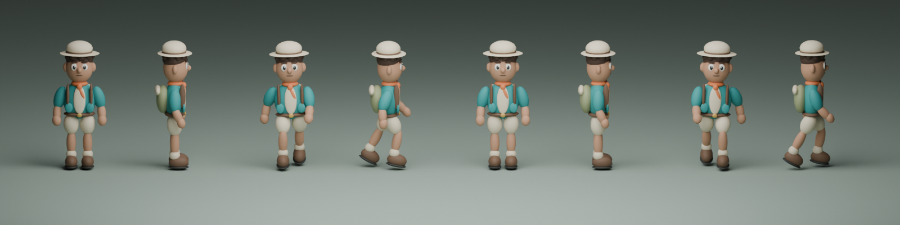
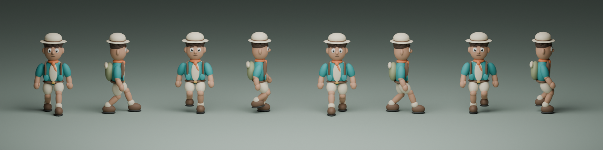

# Nile Quest — character and controls review

6 September 2026. Third local prototype iteration. **Pass for this bounded software review.**

David requested better movement, assets and explanations for primary pupils on computers/tablets, then a choice of male/female characters. Specialist agents saved movement, animation and independent test work before interruption; the integration lead completed the interface, character selection, corrections and verification. This is a software and visual review, not a child usability study.

## Reviewed journey

### 1. Choose an explorer — working

Leo (boy explorer) and Maya (girl explorer) have matching equipment, abilities and learning tasks. Maya has a distinct ponytail silhouette in the world and portrait. Three skin tones update both the model and preview. The selected card uses a tick, text and border. Choices persist locally and can be changed through Settings without changing discoveries or evidence. No personal gender, name or account is requested.

### 2. Learn the controls — improved

Previously, the tablet welcome said “Press E”, and controls had no reusable child-facing explanation. First use now opens three steps: move, look, discover. Wording adapts to touch/computer input, with written instructions and prepared local read-aloud audio. Controls remains available in the world. Panels pause movement; closing restores focus. Returning players can start without repeating the tutorial.

### 3. Explore and stop — improved

The original 844 × 390 screenshot shows the mission panel overlapping the translucent joystick. The new short-landscape card, labelled thumb pad and separate button dock leave movement unobstructed. New action buttons are at least 44 × 44 CSS pixels; their main touch targets are 48 pixels high. Desktop keys, touch movement, Run, Look ahead and automatic guided travel coexist.

Walking accelerates to 3.1 world units/second; running reaches 6.4. A 16% thumb deadzone prevents small drift. Release decelerates promptly; the test checks under 0.2 world units of extra walk travel. Actual displacement drives gait, so pushing into a wall stops footsteps. Keyboard diagonals do not increase speed. Camera pointer ownership is separate from movement; lifting the look finger preserves thumb travel. Focus loss clears motion, run state and camera dragging immediately. Opening a panel preserves an existing guide route while pausing it.

## Character asset assessment

The original walking contact sheet showed straighter knees, raised soles and less convincing foot contact. Revised player clips use a planted-foot phase, bent-knee recovery, level-foot compensation, coordinated arms and a smoother hands-up celebration. Both playable characters use the revised rig. Playback responds to movement speed and blends between Idle, Walk, Run and Celebrate.

Six original editable Blender designs and six GLBs are retained. All six exported assets have finite animation samples and matching loop endpoints; both player models were exercised in Chrome. The four supporting characters retain their existing role designs and idle behaviour. The result is a coherent stylised prototype. It is not a motion-capture character, final commercial art sign-off or proof of suitability for every primary child. Hair is rigidly attached to the head, and capsule-style joints remain visibly stylised.

## Verification evidence

| Check | Result |
| --- | --- |
| Learning/preferences unit tests | 11 passed |
| Complete seven-mission browser journey | 18 checks passed; no page errors or failed/external requests |
| Desktop/tablet controls | 22 checks passed at 1440 × 900, 1024 × 768, 768 × 1024 and 844 × 390 |
| Isolated movement/animation | 10 checks passed |
| Character selection, saved evidence and layouts | 8 checks passed, repeated against the fixed production build; includes 320 × 740 |
| Exported animation integrity | All six GLBs passed |
| Existing interface and resilience | 6 + 4 checks passed |
| Navigation | 7 groups passed, including 49 mission pairs and 70 difficult starts |
| Production build and agent-browser smoke check | Passed; large-chunk advisory remains |

The final character workflow has no uncaught page exceptions or failed assets. Reports and screenshots are under `test-results/`. The immutable built snapshot for this review is `test-results/controls-release`; `controls-release-manifest.json` records source/asset hashes. The regular user preview remains port 4173.

An initial multi-touch test incorrectly sent `touchEnd` with a remaining finger. [Chrome's protocol](https://chromedevtools.github.io/devtools-protocol/tot/Input/#method-dispatchTouchEvent) requires end/cancel to have no active points. Correcting the active-point sequence made the two-finger test valid. A separate genuine delay in the Run label on blur was fixed in the interface. Blur is explicitly dispatched in the automated test; real OS/app-switch behaviour remains untested.

## Remaining validation

Physical iPads, Chromebooks, Safari, assistive technologies and appropriately supervised child sessions remain necessary. Check independent movement/stopping, comfortable camera use, discovering help, reachability with different hand sizes and whether children recognise/like their explorer. School-device performance and learning benefit have not been established.

The touch sizing target draws on [W3C's enhanced target-size guidance](https://www.w3.org/WAI/WCAG22/Understanding/target-size-enhanced.html); guided travel and button alternatives support the approach described by [W3C's dragging guidance](https://www.w3.org/WAI/WCAG22/Understanding/dragging-movements.html). These are design inputs, not a full WCAG conformance claim. Existing voice-redistribution and pupil-service boundaries remain in the README. No public launch or real pupil data was involved.
