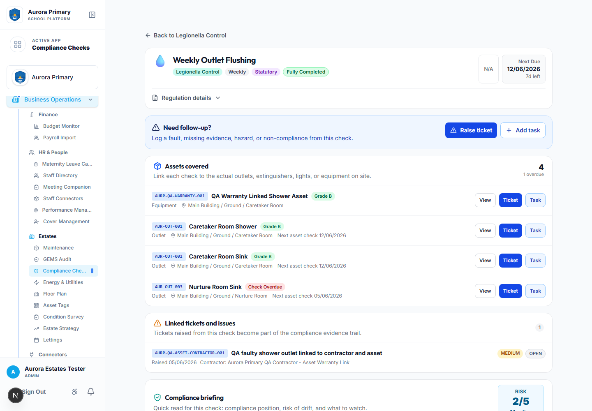
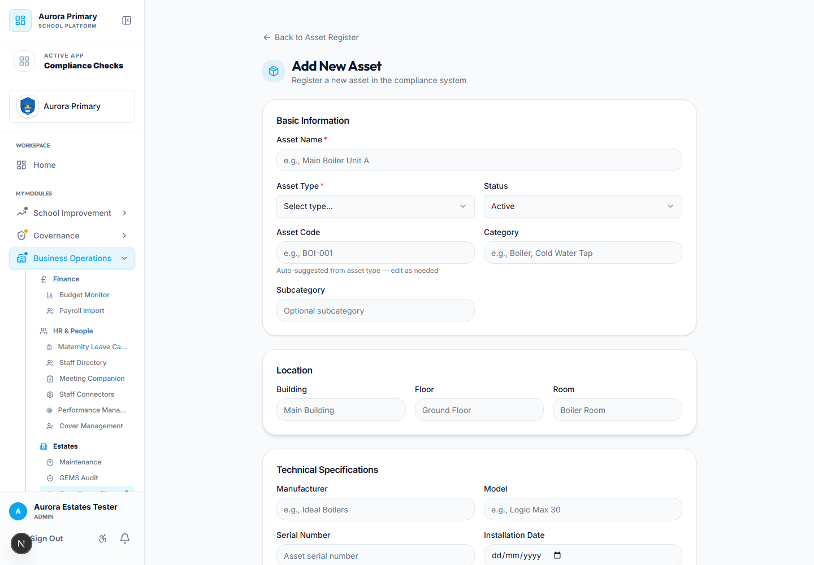
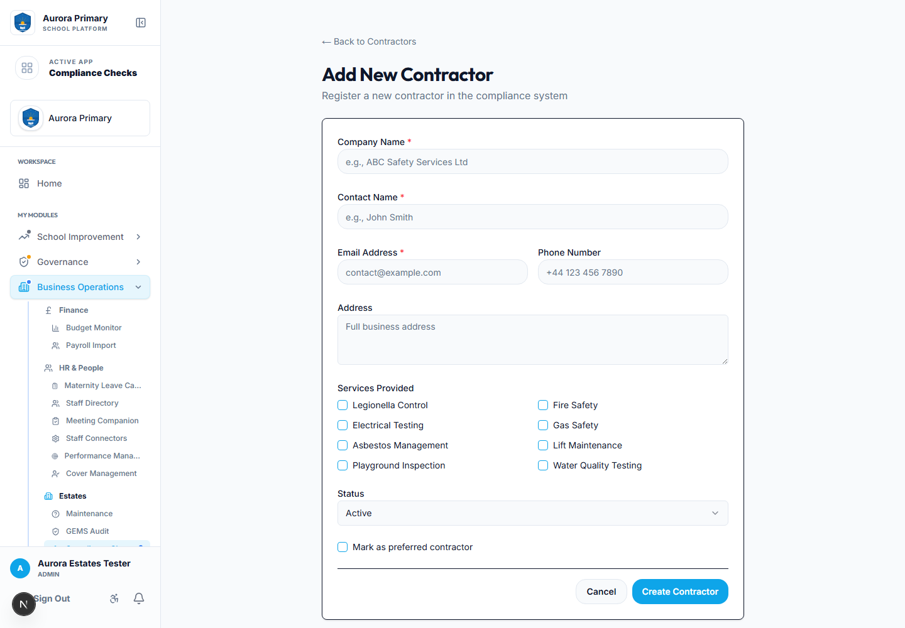
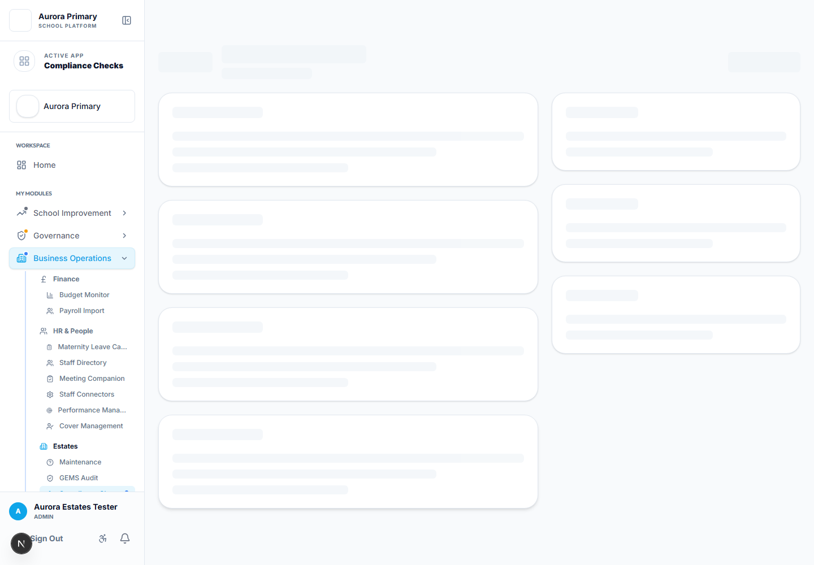
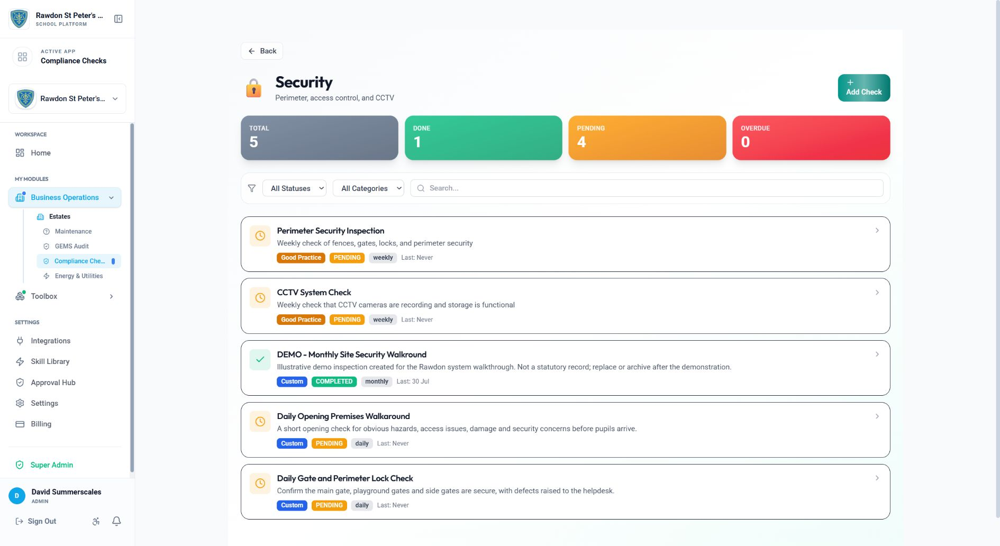
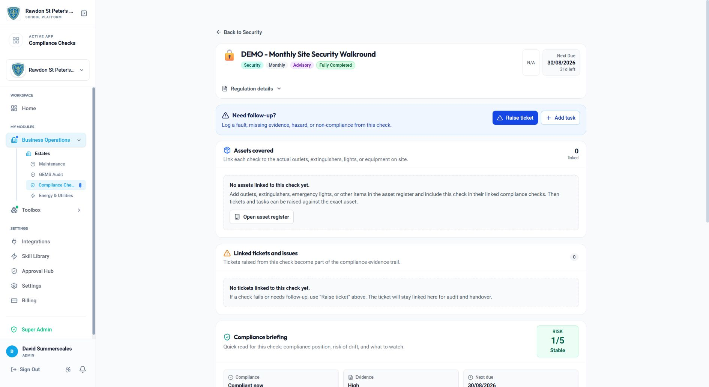
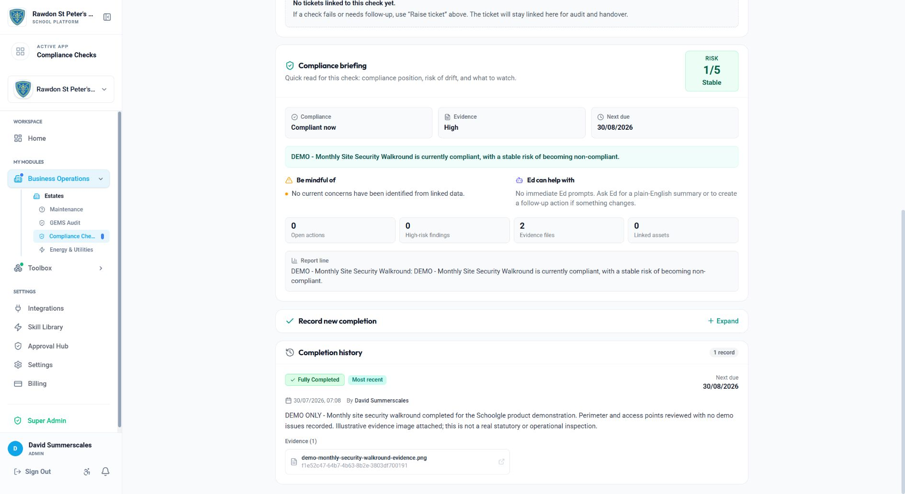
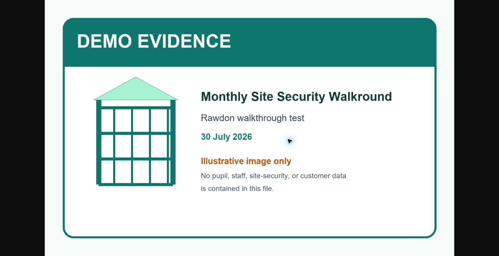
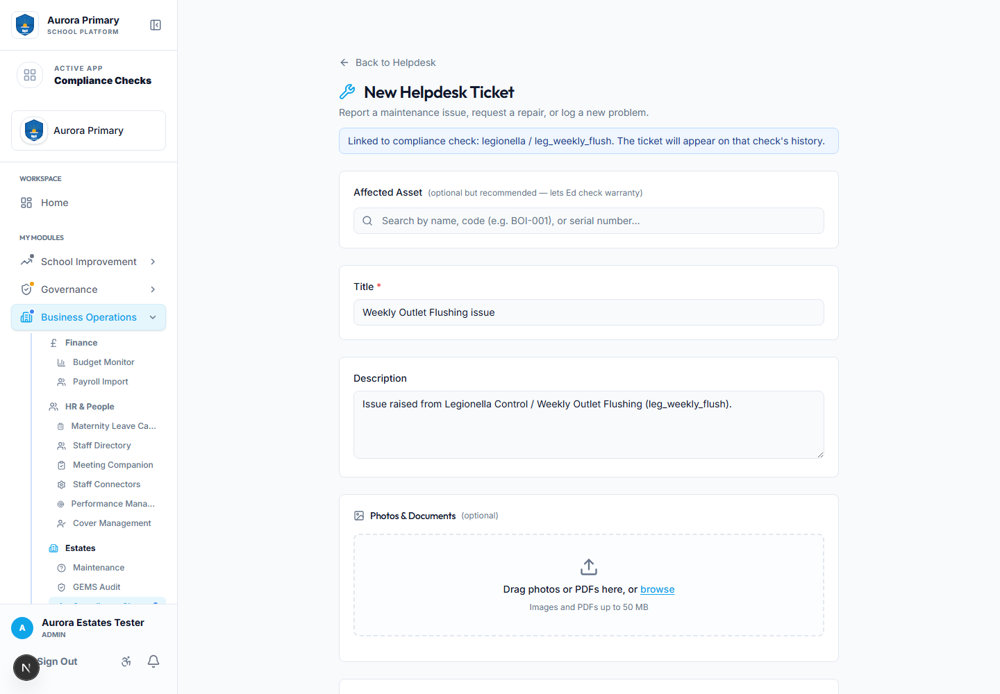
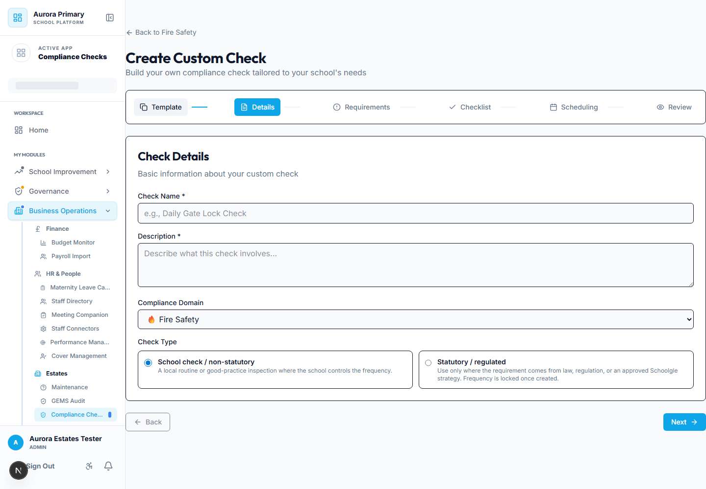

# Schoolgle Estates Management Customer Guide

**Audience:** school business managers, site managers, caretakers, office teams, and senior leaders using the Estates Management app.

**Example schools used in screenshots:** Aurora Primary test environment for general setup screens, plus a clearly labelled demo-only monthly check in the live Rawdon St Peter's instance for the save, reload, recurrence, and evidence workflow.

## 1. How the Estates Management app fits together

The Estates Management app is designed to keep the operational picture joined up:

- **Assets** are the real items on site: showers, outlets, fire extinguishers, emergency lights, boilers, playground equipment, lifts, gates, and similar items.
- **Contractors** are the suppliers, maintainers, inspectors, or warranty contacts connected to those assets and jobs.
- **Compliance checks** are the statutory, good-practice, or school-created inspections that need recording.
- **Tickets** are issues raised when something fails, needs repair, or needs follow-up.
- **Tasks** are scheduled jobs or actions that need allocating to staff or contractors.
- **Evidence** is the audit trail: completion records, notes, photos, documents, invoices, certificates, receipts, and warranty information.

The intended loop is:

1. Add the asset.
2. Link it to the relevant contractor and compliance checks.
3. Complete the inspection/check.
4. Raise a ticket or task if the check identifies an issue.
5. Resolve the issue and attach evidence.
6. Return to the asset or compliance check to see the full history.

## 2. Add an asset

Use this when the school buys, installs, records, or asset-tags a specific item.

1. Open **Estates → Asset Tags** or **Estates → Assets**.
2. Select **Add Asset**.
3. Enter the asset name, type, code, location, and status.
4. Add purchase details such as purchase date, value, purchase order, invoice number, and warranty dates.
5. Select the **supplier / purchased from contractor** if the item was bought from a known contractor.
6. Select the **maintainer / warranty contractor** if a different contractor maintains or services it.
7. Link the relevant compliance domains and checks, for example:
   - `legionella` and `leg_weekly_flush` for a shower or water outlet.
   - `fire` and the relevant extinguisher/fire-door/emergency-light checks.
8. Save the asset.

### QR code / asset tag

Each asset can have its own QR code or asset code. Print the QR label and attach it to the physical item. When scanned, it should take staff to that asset record so they can view location, warranty, inspection history, linked tickets, and supporting evidence.

## 3. Add a contractor

Use contractors for suppliers, service providers, inspectors, maintenance companies, and warranty contacts.

1. Open **Estates → Contractors**.
2. Select **Add Contractor**.
3. Add company name, contact person, phone, email, website, services, notes, and status.
4. Mark the contractor as preferred where appropriate.
5. Save the contractor.

### Contractor roles

A contractor can be connected in several ways:

- **Supplier:** the organisation the school bought an asset from.
- **Maintainer:** the organisation responsible for servicing, warranty support, inspection, or repairs.
- **Ticket contractor:** the contractor assigned to resolve a specific issue.
- **Task contractor:** the contractor assigned to complete a planned job or inspection.

This means the school can track who supplied an item, who maintains it, who attended an issue, and what evidence was produced.

## 4. Link an asset and contractor to a compliance check

Use this when an inspection applies to specific assets, such as flushing outlets, fire extinguishers, emergency lights, or playground items.

1. Open the asset record.
2. Edit the asset.
3. In the compliance area, select the relevant domain and check.
4. Choose the supplier and maintainer contractors where known.
5. Save.
6. Open the compliance check. The asset should appear under **Assets covered**.

## 5. Complete a compliance check

1. Open **Estates → Compliance Checks**.
2. Choose the domain, for example **Legionella Control** or **Fire Safety**.
3. Select the check.
4. Review the frequency, statutory/advisory label, next due date, linked assets, and compliance briefing.
5. Select **Record completion**.
6. Enter status, inspection date, notes, next due date, and evidence where required.
7. Save the completion.

At the bottom of the check page, use **Completion history** to see previous records, who completed them, when they were completed, what was recorded, and what evidence was attached.

### Prove that the record has been saved

After saving a completion:

1. Return to the domain list and confirm the check now shows **Completed** and the latest inspection date.
2. Reopen the check.
3. Confirm the status, next due date, responsible person, notes, and evidence appear in **Completion history**.
4. Select the evidence filename to open the saved image or document.
5. Reload the browser and confirm the same information remains.

The system calculates the next due date from the check frequency. For example, the monthly Rawdon walkthrough recorded on **30 July 2026** automatically moved the next due date to **30 August 2026**.

### Rawdon walkthrough used for this guide

The live acceptance test used **DEMO - Monthly Site Security Walkround**, a private, non-statutory check labelled throughout as illustrative. This avoids creating a false statutory compliance record while still proving the real customer workflow:

- create a monthly school check;
- record a fully completed inspection;
- retain factual notes;
- attach a non-sensitive image;
- calculate the next due date;
- leave and reopen the page;
- open the stored image from the completion history.

Do not use a real statutory check for a demonstration unless the school has genuinely completed the inspection and the evidence is accurate.

## 6. Raise a ticket from a failed check

Use this when a check identifies an issue, fault, missing evidence, hazard, non-compliance, or repair need.

1. Open the compliance check.
2. Select **Raise ticket** in the **Need follow-up?** area.
3. The ticket form opens with the compliance domain and check already linked.
4. Select the affected asset if the issue relates to a specific item.
5. Add photos, PDFs, notes, priority, category, and location.
6. Save the ticket.

The ticket will then appear on:

- the compliance check’s linked ticket history;
- the asset record if an asset was selected;
- the helpdesk list;
- contractor history if a contractor is assigned.

## 7. Add a follow-up task from a check

Use this when the issue is more of an action than a fault report, for example scheduling a contractor visit or assigning an internal caretaker job.

1. Open the compliance check.
2. Select **Add task**.
3. Confirm the title, description, domain, asset, assignee, due date, and contractor if required.
4. Save the task.

The task remains linked to the compliance check so the school can prove that failed or partial inspections were followed through.

## 8. Replace or remove an asset

Use this when an item is replaced, removed from site, or taken out of service.

1. Open the existing asset.
2. Review any open tickets, tasks, warranty information, and evidence.
3. Change the old asset status to **disposed**, **retired**, **inactive**, or **under repair** as appropriate.
4. Add notes explaining why the asset was removed or replaced.
5. Add the new asset as a separate record.
6. Link the new asset to the relevant compliance checks and contractor.
7. Print and attach a new QR label for the replacement item.

Do not overwrite the old asset with the new item if you need a clear audit trail. Keeping the old asset record preserves its history.

## 9. Create your own school check

Use school-created checks for routines that matter locally but are not part of the fixed statutory library.

1. Open the relevant compliance domain, such as **Fire Safety**.
2. Select **Add Check**.
3. Start from a template or from scratch.
4. Add name, description, domain, evidence required, checklist items, frequency, tags, and visibility.
5. Choose the check type:
   - **School check / non-statutory:** local routine or good-practice check where the school controls the frequency.
   - **Statutory / regulated:** only use where the requirement comes from law, regulation, trust policy, or an approved Schoolgle strategy.
6. If statutory/regulated is selected, add the statutory or strategy reference.
7. Save the check.

### Statutory frequency rule

Statutory check frequencies should not be freely changed by the school. They should come from the regulation, approved strategy, or Schoolgle-managed statutory check library. School-created statutory checks are frequency-locked once saved.

## 10. What to check during handover or audit

Before an Estates handover, audit, or customer test, confirm:

- key assets exist and have locations;
- assets have supplier and maintainer contractors where known;
- assets are linked to the relevant compliance checks;
- compliance checks have completion history;
- failed checks have linked tickets or tasks;
- tickets show status and resolution evidence;
- asset warranty and purchase information is recorded;
- old/replaced assets are not deleted if their history is needed.

## 11. Mobile and iPad tips

- Use QR codes to open asset records quickly while walking the site.
- Keep check notes short and factual.
- Attach photos at the point of inspection where possible.
- Raise tickets directly from the compliance check or asset page so the link is automatic.
- Use the asset location fields consistently: building, floor, room, or area.

## 12. Current customer testing checklist

For a customer demonstration:

- use a clearly labelled private demo check for save-and-reload testing;
- add factual notes and a non-sensitive image;
- confirm the check changes to completed in the domain list;
- confirm the next due date follows the selected recurrence;
- reopen the record and confirm the notes and evidence remain;
- open the saved image from completion history;
- use Aurora Primary, not a live customer, to demonstrate invented failures and automatic ticket creation;
- test asset supplier and maintainer contractor roles;
- test warranty and purchase fields on the asset register;
- test the statutory classification guardrail and frequency-lock warning.
